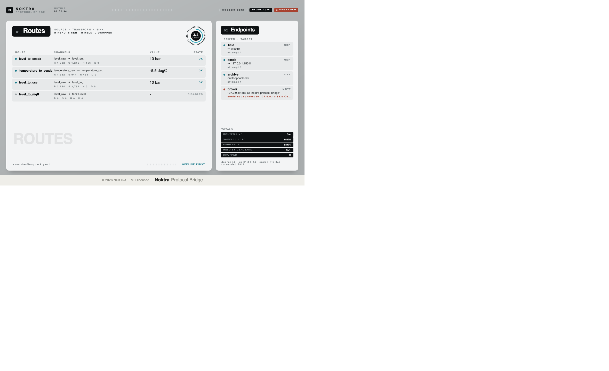

# Noktra Protocol Bridge

Channel mapping protocol bridge. One configuration file turns a flow such as
*Modbus register → scale → MQTT topic* into unattended operation.

Offline-first: no cloud service is contacted, and nothing outside the configured endpoints is
needed at run time.



| | |
|---|---|
| **Sources** | Modbus TCP master (polling) · UDP listener · serial line |
| **Sinks** | UDP · serial line · MQTT 3.1.1 publisher (QoS 0) · CSV file |
| **Per route** | scale + offset, engineering unit, deadband, periodic or on-change trigger |
| **Reliability** | per-endpoint auto-reconnect with exponential backoff; a failed endpoint or route never stops the others |

## Quick start

Download `bridge.exe` from the [latest release](../../releases/latest), or build from source with
`dotnet publish` (see [Building](#building)).

**1 — Check the wiring.** This validates every setting and every channel address but connects to
nothing, so it is safe to run against a live plant.

```console
$ bridge check examples/loopback.yaml
loopback-demo — 4 endpoint(s), 6 channel(s), 4 route(s), 3 enabled

Endpoints
  ID       TYPE
  field    udp
  scada    udp
  archive  csv
  broker   mqtt

Routes
  ID                    SOURCE                      SINK                        TRIGGER        TRANSFORM               ENABLED
  level_to_scada        level_raw (offset:0)        level_out (offset:0)        on change      x0.1 deadband 0.05 bar  yes
  temperature_to_scada  temperature_raw (offset:2)  temperature_out (offset:4)  on change      x0.1 deadband 0.2 degC  yes
  level_to_csv          level_raw (offset:0)        level_log (csv:0)           every 1000 ms  x0.1 bar                yes
  level_to_mqtt         level_raw (offset:0)        tank1.level (topic:0)       on change      x0.1 deadband 0.05 bar  no

OK — examples/loopback.yaml is valid.
```

**2 — Run it.** It keeps going until you stop it with Ctrl+C, or with `SIGTERM` from a service
manager.

```console
$ bridge run examples/loopback.yaml
Noktra Protocol Bridge 0.1.0 — running 'loopback-demo' from examples/loopback.yaml. Ctrl+C to stop.
[info] loopback-demo: starting 3 route(s) over 4 endpoint(s).
[info] field: connected to ← :15010.
[info] scada: connected to → 127.0.0.1:15011.
[info] archive: connected to out/loopback.csv.
[status] healthy · up 10.0s · endpoints 4/4 · forwarded 12
```

**3 — Feed it.** The shipped example listens for a 4-byte big-endian frame on `127.0.0.1:15010`
(raw level, then raw temperature) and republishes engineering values over UDP and into a CSV log.

```console
$ python3 -c "import socket,struct; socket.socket(socket.AF_INET,socket.SOCK_DGRAM).sendto(struct.pack('>Hh',250,-55),('127.0.0.1',15010))"
$ tail -2 out/loopback.csv
2026-07-30T12:09:19.422Z,level_log,25,bar,Good
2026-07-30T12:09:20.423Z,level_log,25,bar,Good
```

Stopping it prints a full report of every endpoint and route:

```console
loopback-demo — degraded · up 5.5s · endpoints 3/4 · forwarded 7

Endpoints
  ID       KIND  TARGET                                      STATE      ATTEMPTS  LAST ERROR
  field    udp   ← :15010                                    Connected  1         -
  scada    udp   → 127.0.0.1:15011                           Connected  1         -
  archive  csv   out/loopback.csv                            Connected  1         -
  broker   mqtt  127.0.0.1:1883 as 'noktra-protocol-bridge'  Faulted    4         Connection refused

Routes
  ID                    SOURCE           SINK             HEALTH    READ  SENT  HELD  DROP  LAST VALUE  LAST ERROR
  level_to_scada        level_raw        level_out        Ok        1     1     0     0     25 bar      -
  temperature_to_scada  temperature_raw  temperature_out  Ok        1     1     0     0     -5.5 degC   -
  level_to_csv          level_raw        level_log        Ok        5     5     0     0     25 bar      -
  level_to_mqtt         level_raw        tank1.level      Disabled  0     0     0     0     -           -
```

**4 — Watch it (optional).** `Pb.Monitor --config examples/loopback.yaml` opens the window at the
top of this page, refreshed twice a second. The CLI is the product; the window is an observer.

## Configuration

A configuration has four sections. Keys are `snake_case`; values are case- and dash-insensitive,
so `Modbus-TCP` and `modbus_tcp` are the same thing. Any unknown key is an error, never ignored.

```yaml
bridge:
  name: demo                  # optional, used in logs and the monitor title

endpoints:
  - id: plc                   # referenced by channels
    type: modbus-tcp          # driver, see the table below
    host: 192.168.0.10        # remaining keys are driver settings
    port: 502

channels:
  - name: level_raw           # referenced by routes
    endpoint: plc
    address: holding:0        # address space and index, see each driver
    type: u16                 # bool u16 s16 u32 s32 u64 s64 f32 f64
    byte_order: big_endian    # optional; big_endian little_endian byte_swapped word_swapped
                              #           (abcd)      (dcba)      (badc)       (cdab)

routes:
  - id: level
    source: level_raw
    sink: level_out
    enabled: true             # optional; false parks the route
    trigger:
      mode: periodic          # periodic (needs period_ms) or on_change (source must push)
      period_ms: 500
    transform:
      scale: 0.1              # engineering = raw * scale + offset
      offset: 0.0
      unit: bar
      deadband: 0.05          # forward only when |new - last_sent| >= deadband
```

Every problem in a file is reported at once, with its line number. A configuration is only started
if all of it is valid.

### Endpoint drivers

| `type` | Direction | Address space | Settings |
|---|---|---|---|
| `modbus-tcp` | source | `holding:N` `input:N` `coil:N` `discrete:N` | `host` (required), `port` (502), `unit_id` (1), `timeout_ms` (1000), `connect_timeout_ms` (2000) |
| `udp` | source and/or sink | `offset:N` — byte position in the datagram | `listen_port` + `bind_address` to receive, `host` + `port` to send, `frame_bytes` to fix the payload length |
| `serial` | source and sink | `offset:N` — byte position in the frame | `port` (required), `baud_rate` (9600), `parity` (none), `data_bits` (8), `stop_bits` (1), `framing` (`fixed` needs `frame_bytes`, or `delimiter`), `delimiter` (`\n`), `append_delimiter`, `max_frame_bytes` (4096) |
| `mqtt` | sink | `topic:0` — addressed by channel name | `host` (required), `port` (1883), `client_id`, `keep_alive_s` (60), `clean_session`, `user_name`, `password`, `topic_prefix`, `retain`, `payload` (`value` or `json`), `connect_timeout_ms` |
| `csv` | sink | `csv:0` — addressed by channel name | `path` (required), `header` (true), `delimiter` (`,`), `flush_every_row` (true), `timestamp_format` |

Notes on the frame-oriented drivers (`udp`, `serial`): the outgoing payload buffer persists between
writes, so several channels pack into one frame layout. Every write sends the whole current payload,
which means N channels on one endpoint produce N frames per cycle, each carrying the latest value of
all of them.

An `mqtt` channel publishes to `[topic_prefix/]channel-name` with `.` read as a topic level
separator, so channel `tank1.level` under prefix `plant` becomes `plant/tank1/level`.

### What is deliberately not implemented

These fail with an explicit message rather than being guessed at:

- **Modbus writes** — a Modbus endpoint cannot be a route sink.
- **Modbus over a serial line** — RTU inter-frame line timing is not documented in
  [`spec/modbus-tcp-subset.md`](spec/modbus-tcp-subset.md), so the whole variant is blocked. Use a
  Modbus TCP gateway.
- **MQTT QoS 1/2, SUBSCRIBE, Will messages, TLS** — see
  [`spec/mqtt-subset.md`](spec/mqtt-subset.md). An MQTT endpoint is publish-only.
- **OPC UA** — out of scope.

## Exit codes

| Code | Meaning |
|---|---|
| 0 | success |
| 1 | invalid configuration |
| 2 | wrong command line |
| 3 | failed while running |

## Building

Requires the .NET 8 SDK.

```
dotnet build
dotnet test
dotnet publish src/Pb.Cli -c Release -r win-x64 --self-contained true -p:PublishSingleFile=true
```

`Pb.Monitor --screenshot docs/monitor.png` re-renders the image above off-screen, which is also how
the window's layout is reviewed at 2x.

## Protocol implementations

Modbus and MQTT are independent clean-room implementations written from the public specifications
only. What may be implemented is recorded first, with its source, under [`spec/`](spec); anything
absent from those documents is refused at run time instead of being inferred. Verification values
come from the published standards and are pinned as tests — the Modbus CRC of
`11 03 00 6B 00 03`, the MQTT PUBLISH packet `30 07 00 03 74 2F 61 32 31`, and the end-to-end path
from a Modbus register through a scale to a float on the wire.

MODBUS is a trademark of Schneider Electric, licensed to the Modbus Organization. This project is
not affiliated with or endorsed by them.

## Licence

MIT — see [LICENSE](LICENSE).
